# MOUS Pipeline

[](https://github.com/JonathanWade24/MOUS/actions/workflows/ci.yml)
[](https://www.python.org/downloads/)
[](LICENSE)
[](https://mne.tools/)

> Automated MEG analysis from raw CTF recordings to group-level inference.

The MOUS study (Mother Of all Unification Studies) investigates how oscillatory dynamics and traveling waves relate to language processing—and, in Aim 2, how those signals couple to fMRI. Running the analysis by hand meant downloading subjects from the Radboud Data Repository one at a time, chaining preprocessing scripts, and hoping nothing drifted between runs.

This repository is a modular Python pipeline that does that work end-to-end: one config file, one CLI, and reproducible derivatives at every stage.

## At a glance

- **Modular stages** (`m1`–`m12`) with dependency-aware partial runs (`--only`, `--skip`)
- **Pydantic-validated YAML configs**; run manifest and live state for observability
- **MNE / scipy / statsmodels** stack; optional fMRI (nilearn) and wave-validation null models
- **Quarto + R** reporting pipeline (HTML dashboards and cumulative subject reports)
- **pytest** suite with fast (`make test-quick`) and full (`make test-full`) targets; GitHub Actions CI on PRs
- **HPC-ready**: SLURM scripts, Palmetto workflow, SSH ops TUI

## Install

From the repository root:

```bash
python3 -m venv .venv
source .venv/bin/activate   # Windows: .venv\Scripts\activate
pip install -e .
```

For most development and cluster work, install the practical extras together:

```bash
pip install -e ".[bids,fmri,ops]"
```

Individual extras:

```bash
pip install -e ".[gui]"     # Streamlit UI (deprecated; removal planned v0.3.0)
pip install -e ".[bids]"    # MNE-BIDS-Pipeline backend for preprocessing
pip install -e ".[fmri]"    # Aim 2 fMRI / nilearn stack
pip install -e ".[ops]"     # SSH-first Textual operations UI
```

### System requirements

- **Python:** 3.10+
- **FreeSurfer** (optional): Required for stage **m5** (source reconstruction). Set `source.subjects_dir` in config and ensure `fsaverage` is available.
- **repocli** (optional): For RDR data fetch. Download from [Donders-Institute/dr-tools releases](https://github.com/Donders-Institute/dr-tools/releases).
- **Cyberduck CLI (`duck`)** (optional): For SFTP/FTP/WebDAV data fetch.

## Quickstart

Canonical configs live under [`configs/`](configs/): `palmetto_hpcnirc_fmri.yaml` and `palmetto_hpcnirc_A2004_A2014.yaml`. See [`configs/README.md`](configs/README.md) for key fields and pipeline toggles.

```bash
# 1. Plan the run (no data touched)
mous-pipeline run --config configs/palmetto_hpcnirc_fmri.yaml --subject A2002 --dry-run

# 2. Execute
mous-pipeline run --config configs/palmetto_hpcnirc_fmri.yaml --subject A2002

# 3. Verify acceptance checks
mous-pipeline verify-run --config configs/palmetto_hpcnirc_fmri.yaml --subject A2002 --strict-mode
```

Monitor a run in another terminal with `mous-pipeline watch --config <cfg> --subject <id> --verbose`.

Before runs that include **m8** reports, check Quarto and R dependencies:

```bash
mous-pipeline check-quarto-env
```

The command exits non-zero when `quarto`, `Rscript`, or required R packages are missing (`ggplot2`, `dplyr`, `knitr`, `lmerTest`, `readr`).

**Outputs:** Derivatives land under `derivatives_root/<subject>/` by stage (e.g. `m4_features/`, `m9_orchestration/`, `m8_reports/`). m8 writes a Python dashboard (`<subject>_report.html`) and a cumulative Quarto report (`<subject>_quarto_report.html`). The run manifest and live state live in `m9_orchestration/`. Aim 2 HTML summaries are written alongside subject and group reports in m8.

## Expected data structure

The pipeline expects CTF `.ds` directories and events TSV under `data_root`:

```
data_root/
└── sub-A2002/
    ├── meg/
    │   ├── sub-A2002_task-auditory_run-01_meg.ds/  (CTF task recording)
    │   └── sub-A2002_task-rest_run-01_meg.ds/      (CTF rest recording)
    └── sub-A2002_task-auditory_events.tsv          (trial metadata)
```

Optional BIDS sidecars can be generated with `mous-pipeline bids-convert`.

## Pipeline architecture

Execution order follows `src/mous_pipeline/m9_orchestration/runner.py` (**m8 reports run last**).

```mermaid
flowchart LR
  m1["m1 Events"] --> m2["m2 Preprocess"] --> m3["m3 Epoching"]
  m3 --> m4["m4 Features"] --> m4t["m4_trial"] --> m6a["m6a Waves"]
  m6a --> m5["m5 Source"] --> m6x["m6_extra"] --> m7["m7 Stats"]
  m7 --> m9["m9 Gating"] --> m10["m10 fMRI"] --> m11["m11 Coupling"]
  m11 --> m12["m12 Validation"] --> m8["m8 Reports"]
```



| Stage | Package folder | Role |
|-------|----------------|------|
| **m1** | `m1_events` | Parse events, trial metadata |
| **m2** | `m2_preprocess` | Notch, resample, ICA (in-house CTF path or `mne_bids_pipeline` backend) |
| **m3** | `m3_epoching` | Task and rest epochs |
| **m4** | `m4_features` | Analytic signal, PSD |
| **m4_trial** | `m4_features` | Pre-stim beta, N400m; Aim 1 trial metrics |
| **m6a** | `m6_waves` | Phase gradient, DCI, sliding metrics |
| **m5** | `m5_source` | Forward / inverse, ROI time series |
| **m6_extra** | `m6_waves` | CFC, 2D FFT, flow, rotational detectors (uses m4 cache when possible) |
| **m7** | `m7_stats` | Permutation, circular stats, trial-wise models |
| **m9** | `m9_orchestration` | Pilot gating verdict (GO / MARGINAL / NO-GO); manifest and live state under `m9_orchestration/` |
| **m10** | `m10_fmri` | Optional: BOLD prep / trial-wise GLM, MEG–fMRI join |
| **m11** | `m11_coupling` | Optional: coupling models on joined trials |
| **m12** | `m12_wave_validation` | Optional: simulation / null DCI (`wave_validation.enabled`) |
| **m8** | `m8_reports` | Exports, figures, cumulative Quarto report, dashboard, Aim2 subject/group HTML summaries |

A full `run` executes every stage in runner order. **m10 / m11** need fMRI configuration and data; they may record a skip reason if BOLD or joins are missing. **m12** runs substantive work only when `wave_validation.enabled` is true in config.

**m0** (intake: `fetch-rdr`, `bids-convert`) is CLI-only and not part of the subject runner.

### Runner flags

Use these to control partial runs, caching, and optional blocks:

```bash
# Plan only: print resolved stages without touching data
mous-pipeline run --config configs/palmetto_hpcnirc_fmri.yaml --subject A2002 --dry-run

# Recompute even when caches exist
mous-pipeline run --config configs/palmetto_hpcnirc_fmri.yaml --subject A2002 --force

# Skip stages (comma-separated)
mous-pipeline run --config configs/palmetto_hpcnirc_fmri.yaml --subject A2002 --skip m8

# Run a subset (must include dependencies; see stage_dependencies)
mous-pipeline run --config configs/palmetto_hpcnirc_fmri.yaml --subject A2002 --only m1,m2,m3

# If you use --only, add optional blocks explicitly:
mous-pipeline run --config configs/palmetto_hpcnirc_fmri.yaml --subject A2002 --only m1,m2,m3,m10,m11 \
  --include-fmri
mous-pipeline run --config configs/palmetto_hpcnirc_fmri.yaml --subject A2002 --only m1,m6a,m12 \
  --include-waves-validation
```

`--include-fmri` / `--include-waves-validation` **add** `m10,m11` or `m12` to an explicit `--only` list. If you omit `--only`, the runner already selects all stages, so those flags are unnecessary.

### Verification

For full runs with source reconstruction (**m5**), see [`docs/TODO_m5_fullrun.md`](docs/TODO_m5_fullrun.md). Common patterns:

```bash
mous-pipeline verify-run --config <cfg> --subject <id> --require-m5 --strict-mode
mous-pipeline verify-run --config <cfg> --subject <id> --require-skip-m5 --strict-mode
```

## CLI commands

| Command | Purpose |
|---------|---------|
| `run` | Full or partial subject pipeline |
| `watch` | Live progress from `run_state.json` |
| `verify-run` | Validate run-manifest invariants for acceptance checks |
| `fetch-subject` | Build or run Cyberduck `duck` download for subject archives |
| `fetch-rdr` | Build or run `repocli get` for Radboud Data Repository (WebDAV) |
| `group` | Aggregate manifests under `derivatives_root` → `group_summary.json` (and trial CSV if present) |
| `bids-convert` | Add in-place BIDS sidecars for a subject |
| `bids-validate` | Check BIDS layout with `mne_bids` + `bids_validator` (dataset at `data_root` or `--root`) |
| `check-quarto-env` | Verify Quarto, R, and required R packages for m8 reports |
| `ops` | SSH-first operations TUI and non-interactive cluster helpers |
| `gui` | Deprecated Streamlit app (sunset; planned removal in v0.3.0) |

## Get data into `data_root`

### RDR (repocli)

1. Install [repocli](https://github.com/Donders-Institute/dr-tools/releases) and run `repocli config` once.
2. At `repo baseurl:` use `https://webdav.data.ru.nl` and your **Data access** credentials.
3. Set `rdr.collection_path` in your YAML (e.g. `dccn/DSC_3011020.09_236_v1`).
4. Pull a subject:

```bash
mous-pipeline fetch-rdr --config configs/palmetto_hpcnirc_fmri.yaml --subject A2002 --execute
```

Bulk cohort fetch options are documented in [`configs/README.md`](configs/README.md).

### Cyberduck CLI (`duck`)

```bash
mous-pipeline fetch-subject \
  --subject A2003 \
  --protocol sftp \
  --host your-host.example.org \
  --remote-root /path/to/mous/archives \
  --local-root . \
  --username your_username
```

Add `--execute` to run the printed command.

## Group-level analysis

After subject runs, manifests live under `<derivatives_root>/<subject>/m9_orchestration/*_run_manifest.json`. Then:

```bash
mous-pipeline group --derivatives-root derivatives/mous_pipeline
mous-pipeline group --derivatives-root derivatives/mous_pipeline --test lme
```

## HPC and cluster operations

For Clemson Palmetto / SLURM cohort runs, operational detail lives in the docs rather than here:

- [`docs/palmetto_hpcnirc.md`](docs/palmetto_hpcnirc.md) — full `hpcnirc` workflow
- [`docs/palmetto_workspace_map.md`](docs/palmetto_workspace_map.md) — laptop/Palmetto workspace map and path reference
- [`docs/ssh_ops_tui.md`](docs/ssh_ops_tui.md) — SSH ops TUI and non-interactive workflows

Representative entry points:

```bash
scripts/palmetto_submit.sh --config configs/palmetto_hpcnirc_fmri.yaml --account YOUR_ACCOUNT --dry-run
mous-pipeline ops run --preset full_submit --config configs/palmetto_hpcnirc_fmri.yaml --subjects A2002 --account YOUR_ACCOUNT
```

Cohort automation scripts (`scripts/run_aims_priority.sh`, `scripts/analysis_*.sh`) and FreeSurfer helpers are in [`scripts/`](scripts/).

## Deprecated GUI

`mous-pipeline gui` and the Streamlit app are deprecated and will be removed in v0.3.0. Use CLI workflows (`run`, `watch`, `verify-run`) instead.

## Testing

The `tests/` directory contains pytest-based tests covering stages, CLI commands, and edge cases:

```bash
pip install -e .  # pytest is included in base dependencies
make test-quick                 # default smoke path (excludes integration/slow)
make test-full                  # full suite (serial)
make test-parallel              # full suite with xdist if installed, else serial fallback
make test-quick-parallel        # quick smoke + xdist if installed
pytest tests/test_m1_events.py -v  # run specific test
```

CI on pull requests runs a fast regression subset: `test_runner_dry_run`, `test_m1_events`, `test_runner_failure_policy`, `test_m10_stub`, and `test_parallelization_plan`.

`integration` and `slow` markers are assigned in `tests/conftest.py`. Quick runs use `-m "not integration and not slow"` to keep local feedback fast.

For parallel execution, install xdist once: `pip install pytest-xdist`.

## Troubleshooting

**"subjects_dir does not exist"** (m5)
: Set `source.subjects_dir` in your YAML to a valid FreeSurfer `SUBJECTS_DIR` containing `fsaverage/`. Or skip m5 with `--skip m5`.

**"inner_skull.surf is missing"** (m5)
: Build BEM surfaces first: `mous-pipeline ops prep-bem --config <cfg> --subjects <id> --execute`, or chain after recon with `mous-pipeline ops prep-m5 --with-bem ... --execute`.

**"No BOLD file found"** (m10)
: Stage m10 requires fMRI data. Either configure `fmri.bold_path` in your YAML, run fMRIPrep, or skip m10/m11 with `--skip m10,m11`.

**"repocli is not on PATH"**
: Install [repocli](https://github.com/Donders-Institute/dr-tools/releases) and run `repocli config` once with base URL `https://webdav.data.ru.nl`.

**Watch command shows "Waiting for run_state.json"**
: Start a `run` in another terminal first. The `watch` command polls the live state file written during pipeline execution.

More edge cases: see [Issues](https://github.com/JonathanWade24/MOUS/issues) or [`docs/`](docs/).

## Contributing

See [`CONTRIBUTING.md`](CONTRIBUTING.md).

## License

MIT — see [`LICENSE`](LICENSE).

Developed for the MOUS study. Questions and bug reports: [GitHub Issues](https://github.com/JonathanWade24/MOUS/issues) · [JonathanWade24](https://github.com/JonathanWade24)
