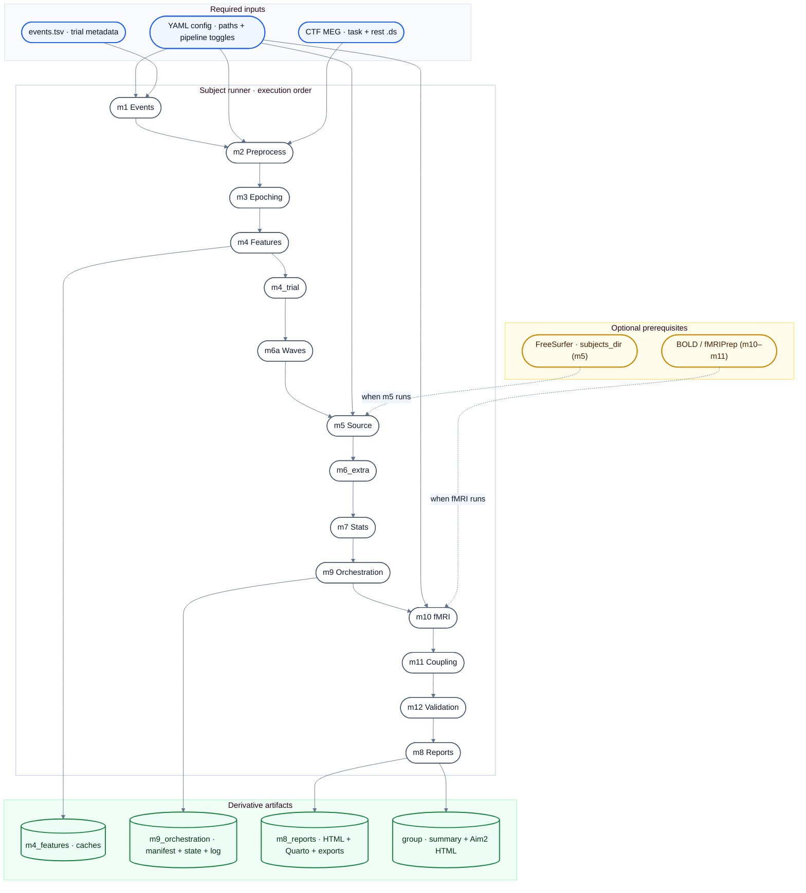

# MOUS Pipeline

Python package for MOUS MEG analysis: events, CTF preprocessing, epoching, spectral and trial features, optional source space, phase-gradient / wave metrics, stats, and HTML/Quarto reports. Optional stages cover fMRI (m10/m11) and wave-validation nulls (m12).

- Python 3.10+ (`pyproject.toml`)
- CLI: `mous-pipeline`
- Code: `src/mous_pipeline/`

## System requirements

- **Python:** 3.10+
- **FreeSurfer** (optional): Required for stage **m5** (source reconstruction). Set `source.subjects_dir` in config and ensure `fsaverage` is available.
- **repocli** (optional): For RDR data fetch. Download from [Donders-Institute/dr-tools releases](https://github.com/Donders-Institute/dr-tools/releases).
- **Cyberduck CLI (`duck`)** (optional): For SFTP/FTP/WebDAV data fetch.

## Install

From the repository root:

```bash
python3 -m venv .venv
source .venv/bin/activate   # Windows: .venv\Scripts\activate
pip install -r requirements-dev.lock
pip install --no-deps -e .
```

For a minimal editable install without the lockfile:

```bash
pip install -e .
```

Optional extras:

```bash
pip install -e ".[gui]"     # Streamlit UI
pip install -e ".[bids]"    # MNE-BIDS-Pipeline backend for preprocessing
pip install -e ".[fmri]"    # Aim 2 fMRI / nilearn stack
pip install -e ".[ops]"     # SSH-first Textual operations UI
pip install -e ".[dev]"     # pytest, ruff (also in requirements-dev.lock)
```

See [docs/reproducibility.md](docs/reproducibility.md) for environment variables, lockfile regeneration, Docker, and Apptainer.

## Run with Docker

Build and run the core pipeline (MEG stages; fMRIPrep/FreeSurfer/Quarto remain external):

```bash
docker build -t mous-pipeline:latest .
docker run --rm \
  -v "$PWD/data:/data" \
  -v "$PWD/derivatives:/derivatives" \
  -v "$PWD/configs/example_container.yaml:/config.yaml:ro" \
  mous-pipeline:latest run --config /config.yaml --subject A2002 --dry-run
```

Mount pre-fetched data at `/data` and write derivatives to `/derivatives`. Use `configs/example_container.yaml` or set `MOUS_DATA_ROOT` / `MOUS_DERIVATIVES_ROOT` in your own config.

## Expected data structure

The pipeline expects CTF `.ds` directories and events TSV under `data_root`:

```
data_root/
└── sub-A2002/
    ├── meg/
    │   ├── sub-A2002_task-auditory_run-01_meg.ds/  (CTF task recording)
    │   └── sub-A2002_task-rest_run-01_meg.ds/      (CTF rest recording)
    └── sub-A2002_task-auditory_events.tsv          (trial metadata)
```

Optional BIDS sidecars can be generated with `mous-pipeline bids-convert`.

## Quickstart

```bash
mous-pipeline run --config configs/pilot_A2002.yaml --subject A2002
```

GUI deprecation notice: `mous-pipeline gui` is deprecated and will be removed in v0.3.0.
Use CLI-first workflows (`run`, `watch`, `verify-run`) for ongoing use.

Before full runs that include `m8`, verify Quarto runtime dependencies:

```bash
mous-pipeline check-quarto-env
```

The command exits non-zero when `quarto`, `Rscript`, or required R packages are missing (`ggplot2`, `dplyr`, `knitr`, `lmerTest`, `readr`).

Canonical configs live under `configs/`: `palmetto_hpcnirc_fmri.yaml` and `palmetto_hpcnirc_A2004_A2014.yaml`. YAML fields include `data_root`, `derivatives_root`, `rdr`, `preprocess`, `epoching`, `features`, `source`, optional `fmri` / `wave_validation`, and `pipeline`.

Pipeline behavior toggles can be set under `pipeline`, for example:
- `strict_stage_failures` (default true in CI): hard-fail critical stage errors (`m10`, `m11`),
- `m10_n_jobs` (default `1`): nilearn `FirstLevelModel` worker count for m10 GLM,
- `m10_force_gc` (default `true`): force cleanup pass after m10.

**Outputs:** Derivatives land under `derivatives_root/<subject>/` organized by stage (e.g. `m4_features/`, `m9_orchestration/`, `m8_reports/`). m8 writes a Python dashboard (`<subject>_report.html`) and a single cumulative Quarto report (`<subject>_quarto_report.html`) under `m8_reports/`; the run manifest lives in `m9_orchestration/`.
Legacy per-aim Quarto templates remain in `reports/` for ad-hoc use, but the pipeline now renders only `reports/subject_full_report.qmd`.
Aim2-specific HTML summaries are also generated in m8:
- Subject: `<derivatives_root>/<subject>/m8_reports/<subject>_aim2_summary.html`
- Group: `<derivatives_root>/group_aim2_summary.html`

## Pipeline stages

Stages run in this order (see `src/mous_pipeline/stage_dependencies.py`). Dependencies between stages are enforced when you use `--only`.

### Pipeline flow diagram



| Stage | Package folder | Role |
|-------|----------------|------|
| **m1** | `m1_events` | Parse events, trial metadata |
| **m2** | `m2_preprocess` | Notch, resample, ICA (in-house CTF path or `mne_bids_pipeline` backend) |
| **m3** | `m3_epoching` | Task and rest epochs |
| **m4** | `m4_features` | Analytic signal, PSD |
| **m4_trial** | `m4_features` | Pre-stim beta, N400m; Aim 1 trial metrics |
| **m5** | `m5_source` | Forward / inverse, ROI time series |
| **m6a** | `m6_waves` | Phase gradient, DCI, sliding metrics |
| **m6_extra** | `m6_waves` | CFC, 2D FFT, flow, rotational detectors (uses m4 cache when possible) |
| **m10** | `m10_fmri` | Optional: BOLD prep / trial-wise GLM, MEG–fMRI join |
| **m11** | `m11_coupling` | Optional: coupling models on joined trials |
| **m12** | `m12_wave_validation` | Optional: simulation / null DCI (`wave_validation.enabled`) |
| **m7** | `m7_stats` | Permutation, circular stats, trial-wise models |
| **m8** | `m8_reports` | Exports, figures, cumulative Quarto report, dashboard, Aim2 subject/group HTML summaries |
| **m9** | `m9_orchestration` | Manifest, run state, live log under subject derivatives |

A full `run` executes every stage in `STAGE_ORDER`. **m10 / m11** need fMRI configuration and data; they may record a skip reason if BOLD or joins are missing. **m12** runs substantive work only when `wave_validation.enabled` is true in config.

### Runner flags

```bash
# Plan only: print resolved stages without touching data
mous-pipeline run --config configs/palmetto_hpcnirc_fmri.yaml --subject A2002 --dry-run

# Recompute even when caches exist
mous-pipeline run --config configs/palmetto_hpcnirc_fmri.yaml --subject A2002 --force

# Skip stages (comma-separated)
mous-pipeline run --config configs/palmetto_hpcnirc_fmri.yaml --subject A2002 --skip m8

# Run a subset (must include dependencies; see stage_dependencies)
mous-pipeline run --config configs/palmetto_hpcnirc_fmri.yaml --subject A2002 --only m1,m2,m3

# If you use --only, add optional blocks explicitly:
mous-pipeline run --config configs/palmetto_hpcnirc_fmri.yaml --subject A2002 --only m1,m2,m3,m10,m11 \
  --include-fmri
mous-pipeline run --config configs/palmetto_hpcnirc_fmri.yaml --subject A2002 --only m1,m6a,m12 \
  --include-waves-validation
```

`--include-fmri` / `--include-waves-validation` **add** `m10,m11` or `m12` to an explicit `--only` list. If you omit `--only`, the runner already selects all stages, so those flags are unnecessary.

### Full-run verification (with m5)

Use this protocol after FreeSurfer recon-all outputs are available under
`source.subjects_dir`:

```bash
mous-pipeline run --config <cfg> --subject <id> --dry-run
mous-pipeline run --config <cfg> --subject <id> --force
mous-pipeline watch --config <cfg> --subject <id> --verbose
mous-pipeline verify-run --config <cfg> --subject <id> --require-m5 --strict-mode
```

Expected acceptance checks:
- run manifest `metrics.run_status` is `done` or `completed_with_skips`,
- `metrics.skipped_stages` does not include `m5`,
- `metrics.source_dci_zinnen` or `metrics.m5_n_stcs` is present,
- strict verification has no `m10_error` or `m11_error`.

### Full-run verification (skip m5)

Use this protocol before Neurodesk pull/runs when source reconstruction (`m5`) is deferred:

```bash
mous-pipeline run --config <cfg> --subject <id> --skip m5 --dry-run
mous-pipeline run --config <cfg> --subject <id> --skip m5 --force
mous-pipeline watch --config <cfg> --subject <id> --verbose
mous-pipeline verify-run --config <cfg> --subject <id> --require-skip-m5 --strict-mode
```

Expected acceptance checks:
- run manifest `metrics.run_status` is `done` or `completed_with_skips`,
- `metrics.skipped_stages` includes `m5`,
- strict verification has no `m10_error` or `m11_error`,
- manifest contains non-empty outputs.

### Watch a run

Polls `derivatives/.../m9_orchestration/sub-<id>_run_state.json` written during `run`:

```bash
mous-pipeline watch --config configs/palmetto_hpcnirc_fmri.yaml --subject A2002
mous-pipeline watch --config configs/palmetto_hpcnirc_fmri.yaml --subject A2002 --verbose
```

## CLI commands (overview)

| Command | Purpose |
|---------|---------|
| `run` | Full or partial subject pipeline |
| `watch` | Live progress from `run_state.json` |
| `verify-run` | Validate run-manifest invariants for acceptance checks |
| `fetch-subject` | Build or run Cyberduck `duck` download for subject archives |
| `fetch-rdr` | Build or run `repocli get` for Radboud Data Repository (WebDAV) |
| `group` | Aggregate manifests under `derivatives_root` → `group_summary.json` (and trial CSV if present) |
| `bids-convert` | Add in-place BIDS sidecars for a subject |
| `bids-validate` | Check BIDS layout with `mne_bids` + `bids_validator` (dataset at `data_root` or `--root`) |
| `gui` | Start deprecated Streamlit app (sunset; planned removal in v0.3.0) |

## Get data into `data_root`

### RDR (repocli)

1. Install [repocli](https://github.com/Donders-Institute/dr-tools/releases) and run `repocli config` once.
2. At `repo baseurl:` use `https://webdav.data.ru.nl` and your **Data access** credentials.
3. Set `rdr.collection_path` in your YAML (e.g. `dccn/DSC_3011020.09_236_v1`).
4. Pull a subject:

```bash
mous-pipeline fetch-rdr --config configs/palmetto_hpcnirc_fmri.yaml --subject A2002 --execute
```

Override collection path if needed:

```bash
mous-pipeline fetch-rdr --subject A2003 --collection-path dccn/DSC_3011020.09_236_v1 --dest . --execute
```

Fetch every valid `sub-A####` subject advertised by the RDR collection and
continue past missing/invalid entries:

```bash
mous-pipeline fetch-rdr \
  --config configs/palmetto_hpcnirc_A2003_A2012.yaml \
  --all-remote-subjects \
  --manifest-out reports/rdr_subject_manifest.json \
  --skip-invalid \
  --execute
```

### Cyberduck CLI (`duck`)

```bash
mous-pipeline fetch-subject \
  --subject A2003 \
  --protocol sftp \
  --host your-host.example.org \
  --remote-root /path/to/mous/archives \
  --local-root . \
  --username your_username
```

Add `--execute` to run the printed command.

## Deprecated Neurodesk / Jupyter GUI (sunset)

`mous-pipeline gui` and the Streamlit app are in deprecation mode and planned for
removal in v0.3.0. Keep using this path only as a short-term bridge.

Neurodesk-oriented setup script (creates `.venv`, installs `.[gui]`, downloads Linux `repocli` into `~/bin`):

```bash
bash setup.sh
repocli config   # baseurl: https://webdav.data.ru.nl
```

**Platform note:** `setup.sh` is Linux x86_64 only (downloads `repocli.x86_64`). On **macOS**, **Windows**, or other platforms, skip the script and install manually (`pip install -e ".[gui]"` + download `repocli` from [releases](https://github.com/Donders-Institute/dr-tools/releases)).

From the repo root:

```bash
source .venv/bin/activate
mous-pipeline gui
# or: streamlit run src/mous_pipeline/gui_streamlit.py
```

On JupyterHub, use the printed proxy URL (often `/proxy/8501/`) to open the app.
For new usage, prefer:

```bash
mous-pipeline run --config <cfg> --subject <id>
mous-pipeline watch --config <cfg> --subject <id>
mous-pipeline verify-run --config <cfg> --subject <id> --strict-mode
```

## Group-level analysis

After subject runs, manifests live under `<derivatives_root>/<subject>/m9_orchestration/*_run_manifest.json`. Then:

```bash
mous-pipeline group --derivatives-root derivatives/mous_pipeline
mous-pipeline group --derivatives-root derivatives/mous_pipeline --test lme
```

## SLURM automation (Workflow tracks)

For cluster-oriented orchestration, use:

```bash
scripts/analysis_00_hpc_setup.sh --check-data
sbatch scripts/analysis_02_freesurfer_recon.sh
scripts/analysis_00_hpc_setup.sh --check-freesurfer
sbatch scripts/analysis_01_cohort_fetch_and_run.sh
```

`analysis_00_hpc_setup.sh` creates the expected `logs/` and `derivatives/`
subdirectories, checks the FreeSurfer license and cohort T1w inputs, and can
optionally submit the FreeSurfer or full-cohort SLURM jobs with
`--submit-recon` / `--submit-cohort`.

For prioritized automation across workflow tracks without mandatory m5 FreeSurfer work, use:

```bash
scripts/run_aims_priority.sh \
  --config configs/palmetto_hpcnirc_fmri.yaml \
  --subjects A2003,A2004 \
  --fetch-missing \
  --partition hpcnirc
```

What it does:
- resolves subjects from config `subjects:` or `--subjects` override,
- optionally fetches missing subjects via `mous-pipeline fetch-rdr --execute`,
- runs a post-merge MEG trial-metrics regression/QC audit on the first subject,
- submits fMRI preprocessing as detached `sbatch --array` jobs,
- runs per-subject MEG stages (`--skip m5,m10,m11` by default),
- runs MEG group aggregation and writes group summary/null artifacts.

Why this can look surprising:
- `mous_driver` is an orchestrator, so it can exit before detached `mous_fmriprep` array jobs finish.
- Treat `mous_driver_*` and `fmriprep_*` logs as separate tracks when monitoring completion.

Preview all commands without executing:

```bash
scripts/run_aims_priority.sh --config configs/palmetto_hpcnirc_fmri.yaml --subjects A2003 --fetch-missing --dry-run
```

Palmetto-specific wrapper and setup docs:

```bash
bash scripts/palmetto_setup.sh
scripts/palmetto_submit.sh --config configs/palmetto_hpcnirc_fmri.yaml --account YOUR_ACCOUNT --dry-run
scripts/palmetto_recon_all.sh --config configs/palmetto_hpcnirc_fmri.yaml --subjects A2002 --account YOUR_ACCOUNT --dry-run
scripts/palmetto_prep_bem.sh --config configs/palmetto_hpcnirc_fmri.yaml --subjects A2002 --account YOUR_ACCOUNT --dry-run
```

For Quarto cumulative reports on Palmetto, install R runtime dependencies once in your `mous-palmetto` conda env:

```bash
conda install -n mous-palmetto -c conda-forge r-base r-ggplot2 r-dplyr r-knitr r-lmertest r-readr
mous-pipeline check-quarto-env
```

See `docs/palmetto_hpcnirc.md` for a full `hpcnirc` workflow and
`docs/palmetto_workspace_map.md` for the Git-first laptop/Palmetto workspace
map, path reference, and selected-result sync commands.

SSH-first operations interface:

```bash
mous-pipeline ops ui
mous-pipeline ops run --preset full_submit --config configs/palmetto_hpcnirc_fmri.yaml --subjects A2002 --account YOUR_ACCOUNT
mous-pipeline ops prep-m5 --config configs/palmetto_hpcnirc_fmri.yaml --subjects A2002 --account YOUR_ACCOUNT --with-bem --dry-run
mous-pipeline ops prep-bem --config configs/palmetto_hpcnirc_fmri.yaml --subjects A2002 --account YOUR_ACCOUNT --dry-run
mous-pipeline ops status
```

See `docs/ssh_ops_tui.md` for full TUI + non-interactive workflow details.

Neurodesk single-subject FreeSurfer helper (safe with spaces in source paths):

```bash
chmod +x scripts/recon_all_neurodesk_safe.sh
scripts/recon_all_neurodesk_safe.sh --subject A2027
```

Optional overrides:

```bash
scripts/recon_all_neurodesk_safe.sh \
  --subject A2027 \
  --data-root "/home/jovyan/MOUS/Pipeline WIP/mous_data" \
  --subjects-dir derivatives/freesurfer \
  --openmp 3
```

## Testing

The `tests/` directory contains pytest-based tests covering stages, CLI commands, and edge cases:

```bash
pip install -e .  # pytest is included in base dependencies
make test-quick                 # default smoke path (excludes integration/slow)
make test-full                  # full suite (serial)
make test-parallel              # full suite with xdist if installed, else serial fallback
make test-quick-parallel        # quick smoke + xdist if installed
pytest tests/test_m1_events.py -v  # run specific test
```

`integration` and `slow` markers are assigned in `tests/conftest.py`. Quick runs use
`-m "not integration and not slow"` to keep local feedback fast while preserving full
assertion coverage in `test-full`/CI runs.

For parallel execution, install xdist once:

```bash
pip install pytest-xdist
```

Tests use fixtures in `tests/conftest.py` for sample data and configs.

## Troubleshooting

**"subjects_dir does not exist"** (m5)
: Set `source.subjects_dir` in your YAML to a valid FreeSurfer `SUBJECTS_DIR` containing `fsaverage/`. Or skip m5 with `--skip m5`.

**"inner_skull.surf is missing"** (m5)
: Build BEM surfaces first: `mous-pipeline ops prep-bem --config <cfg> --subjects <id> --execute`, or chain after recon with `mous-pipeline ops prep-m5 --with-bem ... --execute`.

**"No BOLD file found"** (m10)
: Stage m10 requires fMRI data. Either configure `fmri.bold_path` in your YAML, run fMRIPrep, or skip m10/m11 with `--skip m10,m11`.

**"too many indices for array: array is 1-dimensional, but 2 were indexed"** (m10)
: This indicates an ROI signal shape mismatch during trial-wise beta extraction. The current `trialwise_betas` implementation tolerates both 1D and 2D masker outputs; if you still see this, update to latest `main` and rerun.

**"repocli is not on PATH"**
: Install [repocli](https://github.com/Donders-Institute/dr-tools/releases) and run `repocli config` once with base URL `https://webdav.data.ru.nl`.

**GUI shows "Streamlit not installed"**
: Install with `pip install -e ".[gui]"`.

**Import errors for nilearn/templateflow**
: Install fMRI extras: `pip install -e ".[fmri]"`.

**Watch command shows "Waiting for run_state.json"**
: Start a `run` in another terminal first. The `watch` command polls the live state file written during pipeline execution.

**FreeSurfer fails with `mri_convert: extra argument`**
: The input path usually contains spaces. Use `scripts/recon_all_neurodesk_safe.sh` (or the updated SLURM scripts in `scripts/`), which stage T1w into a no-space path before calling `recon-all`.

## Contributing

See `CONTRIBUTING.md`.
